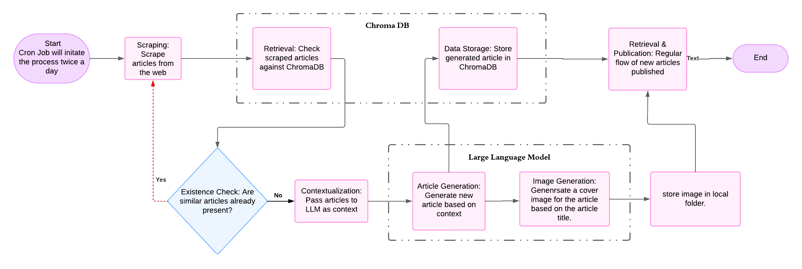

# AI Content Generation 
This project aims to develop an automated system for generating and publishing news articles or blog posts using web scraping, similarity detection, and Large Language Models (LLMs). The system will operate on a scheduled basis, scraping articles from the web, determining if similar articles already exist, and generating new content based on the scraped information if deemed novel. The generated articles will then be published, along with AI-generated cover images.

# FLow Diagram

### Update cred.env
Please update API keys and necessary information for OpenAI.

### How to run?
Install the dependencies using `pip install -r requirements.txt`

1. To run using FastAPI server:
Run `python main.py`
2. To run as a cron job or as a python script.
Run `python cron_job.py`

The API endpoints can be explored by visiting `localhost:3000/docs` in your web browser.

